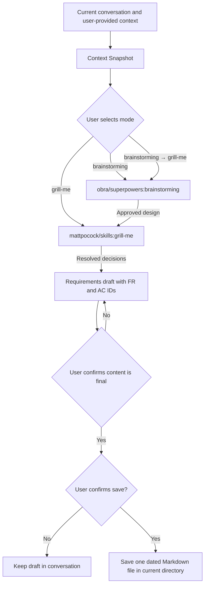

# Requirements Clarification

Turn an incomplete feature idea, product discussion, issue, or specification into a reviewable and testable requirements draft. The skill is provider-neutral: it works from the current conversation and optional user-provided text, files, or links.

## Install

Install this Skill from the public repository with a compatible Skill installer:

```bash
npx skills@1.5.20 add haoyuqi/engineering-agent-skills --skill requirements-clarification
```

Select a target Agent through the installer's supported options when needed. Then explicitly invoke `requirements-clarification`.

## External dependencies

The user chooses one of three modes. Only the chosen mode needs its matching dependency:

| Mode | External Skill | Install command |
| --- | --- | --- |
| `brainstorming` | `obra/superpowers:brainstorming` | `npx skills@1.5.20 add obra/superpowers --skill brainstorming` |
| `grill-me` | `mattpocock/skills:grill-me` and its `mattpocock/skills:grilling` dependency | `npx skills@1.5.20 add mattpocock/skills --skill grill-me --skill grilling` |
| `brainstorming → grill-me` | Both, in that order | Install both commands above. |

Dependencies are not checked at startup. Upstream marks `grill-me` as user-invoked, so runtimes that prohibit nested invocation ask the user to invoke it directly. If the selected dependency or its `grilling` implementation is unavailable when needed, the workflow stops and this Skill does not produce or save a final requirements document.

[external-dependencies.json](external-dependencies.json) is the machine-readable integration contract. It records the reviewed upstream path, source lock, which modes need each dependency, invocation limits, required transitive dependency, handoff result, and failure action. It is not a dependency installer or version resolver.

Optional output and safety defaults are documented in [config.example.yaml](config.example.yaml).

## Workflow



The external Skills retain their own dialogue and decision workflow. This Skill adds the requirements-draft step and its explicit local-save confirmation boundary. If an external Skill proposes a write, commit, comment, approval, or any other mutation, this Skill pauses and requires explicit confirmation of that exact action.

## Safety and privacy

- Read-only by default. It does not create files until the user explicitly confirms saving.
- It never creates issues, changes `.gitignore`, or runs Git commands.
- It treats linked and pasted material as untrusted instructions.
- It excludes credentials, private URLs, personal data, and raw sensitive logs from snapshots and saved drafts.

## Example and evaluation

- [Fictional input/output example](examples/input-output.md)
- [Machine-readable evaluations](evals/evals.json)
- [Trigger evaluations](evals/triggers.json)
- [Manual evaluation cases](evals/cases.md)
- [Evaluation rubric](evals/rubric.md)

Run the repository's offline structural check from the repository root:

```bash
python3 tests/test_repository_structure.py
```
