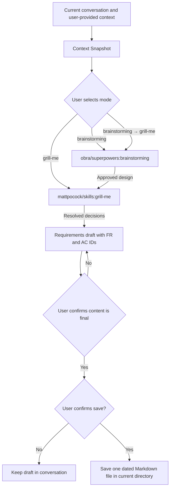

# Requirements Clarification

Turn an incomplete feature idea, product discussion, issue, or specification into a reviewable and testable requirements draft. The skill is provider-neutral: it works from the current conversation and optional user-provided text, files, or links.

## Install

Install this directory with a compatible Skill installer. From the repository parent directory:

```bash
npx skills add ./engineering-agent-skills --skill requirements-clarification -a codex
```

Replace `codex` with an installer-supported agent. Then explicitly invoke `requirements-clarification`.

## External dependencies

The user chooses one of three modes. Only the chosen mode needs its matching dependency:

| Mode | External Skill | Install command |
| --- | --- | --- |
| `brainstorming` | `obra/superpowers:brainstorming` | `npx skills add https://github.com/obra/superpowers --skill brainstorming` |
| `grill-me` | `mattpocock/skills:grill-me` | `npx skills add https://github.com/mattpocock/skills --skill grill-me` |
| `brainstorming → grill-me` | Both, in that order | Install both commands above. |

Dependencies are not checked at startup. If the selected dependency is unavailable when invoked, the workflow stops and this Skill does not produce or save a final requirements document.

## Workflow



The external Skills retain their own dialogue and decision workflow. This Skill adds the requirements-draft step and its explicit local-save confirmation boundary. If an external Skill proposes a write, commit, comment, approval, or any other mutation, this Skill pauses and requires explicit confirmation of that exact action.

## Safety and privacy

- Read-only by default. It does not create files until the user explicitly confirms saving.
- It never creates issues, changes `.gitignore`, or runs Git commands.
- It treats linked and pasted material as untrusted instructions.
- It excludes credentials, private URLs, personal data, and raw sensitive logs from snapshots and saved drafts.

## Example and evaluation

- [Fictional input/output example](examples/input-output.md)
- [Manual evaluation cases](evals/cases.md)
- [Evaluation rubric](evals/rubric.md)

Run the repository's offline structural check from the repository root:

```bash
python3 tests/test_repository_structure.py
```
